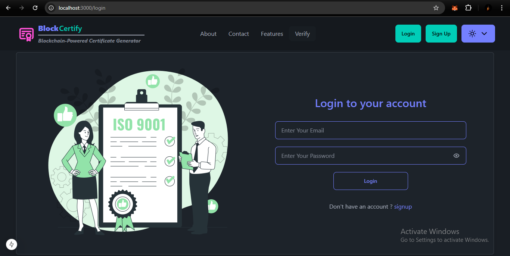
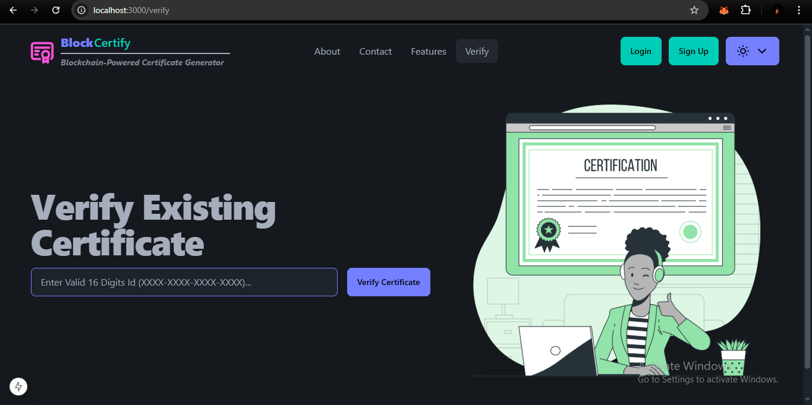

# Blockcertify – Secure Digital Certificate Verification System

Blockcertify is a secure digital certificate issuing and verification platform designed to prevent certificate forgery and ensure authenticity. It provides a reliable way for organizations to issue digital certificates and for users or third parties to verify them instantly.

The system eliminates manual certificate verification and reduces the risk of fake or tampered credentials by maintaining trusted digital records.

> 🧩 **My Role**  
> BlockCertify is designed to allow certificate issue, manage and verify certificate in the blockchain.
> I performed API testing and verified request–response flow between frontend and backend.
> Worked on improving the React frontend and helped ensure proper API integration.
> Setup token based email verification.

--------------------------------------------------

--------------------------------------------------

> 🧩 **Blockcertify is not a public blockchain network..**  
> It is a controlled digital certification system where certificates are issued and verified within a secure environment.

--------------------------------------------------

## Homepage

The homepage provides an overview of the Blockcertify platform and its purpose.
It highlights certificate issuance, verification, and fraud prevention.
Users can easily access the certificate verification feature from the landing page.

--------------------------------------------------

## About Blockcertify

Blockcertify addresses the growing problem of fake certificates in education and professional domains. The platform ensures that every certificate issued can be verified securely and transparently without relying on manual checks or intermediaries.

--------------------------------------------------

## Certificate Issuance

Authorized issuers can generate digital certificates with the following details:

- Unique certificate ID
- Recipient name
- Course or achievement details
- Issuing authority
- Issue date

Each certificate is securely stored and protected against modification.

--------------------------------------------------

## Certificate Verification

Certificates can be verified by anyone using:

- Certificate ID
- Verification link
- QR code (future scope)

The verification process instantly confirms whether a certificate is valid or invalid and displays the certificate details.

--------------------------------------------------

## User Roles and Access

### Admin / Issuer

- Secure login for certificate issuers
- Issue new certificates
- View all issued certificates
- Revoke certificates if required
- Monitor verification activity

### Public User

- No login required
- Simple certificate verification form
- Instant verification result

--------------------------------------------------

## Key Features

- Secure digital certificate issuance
- Tamper-resistant certificate records
- Instant certificate verification
- Web-based access
- Reduces certificate fraud
- Transparent verification system

--------------------------------------------------

## Technologies Used

Frontend:
- HTML
- CSS
- JavaScript

Backend:
- Node.js
- Express.js

Template Engine:
- EJS

Database:
- MongoDB or SQL

Email Service:
- Nodemailer

Version Control:
- Git and GitHub

--------------------------------------------------

## Project Structure

blockcertify/
│
├── src/
│   ├── routes/
│   ├── controllers/
│   ├── models/
│   ├── helper/
│   │   └── mailTemplate.ejs
│   ├── views/
│   └── config/
│
├── public/
├── package.json
├── server.js
└── README.md

--------------------------------------------------

## Setup Instructions

1. Install Setup

2. Install dependencies

npm install

3. Configure environment variables

4. Run the application

npm run dev

5. Open in browser

http://localhost:3000

--------------------------------------------------

## Future Scope

- Blockchain-based certificate immutability
- QR-code based verification
- Multi-issuer support
- Public verification dashboard
- Cloud deployment

--------------------------------------------------

## Contact

Project Name: Blockcertify  
Developer: Harshal Patil  
 

--------------------------------------------------

## License

This project is licensed under the MIT License.

--------------------------------------------------

Blockcertify aims to build trust in digital credentials by ensuring every certificate is authentic, verifiable, and secure.
